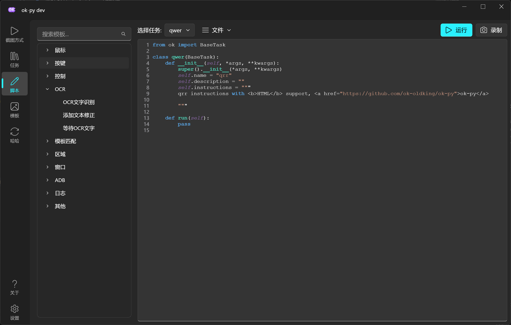
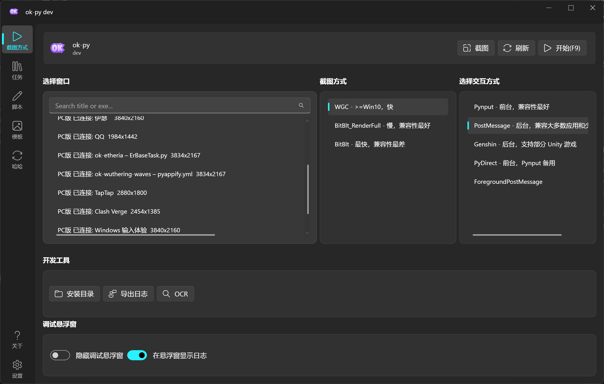
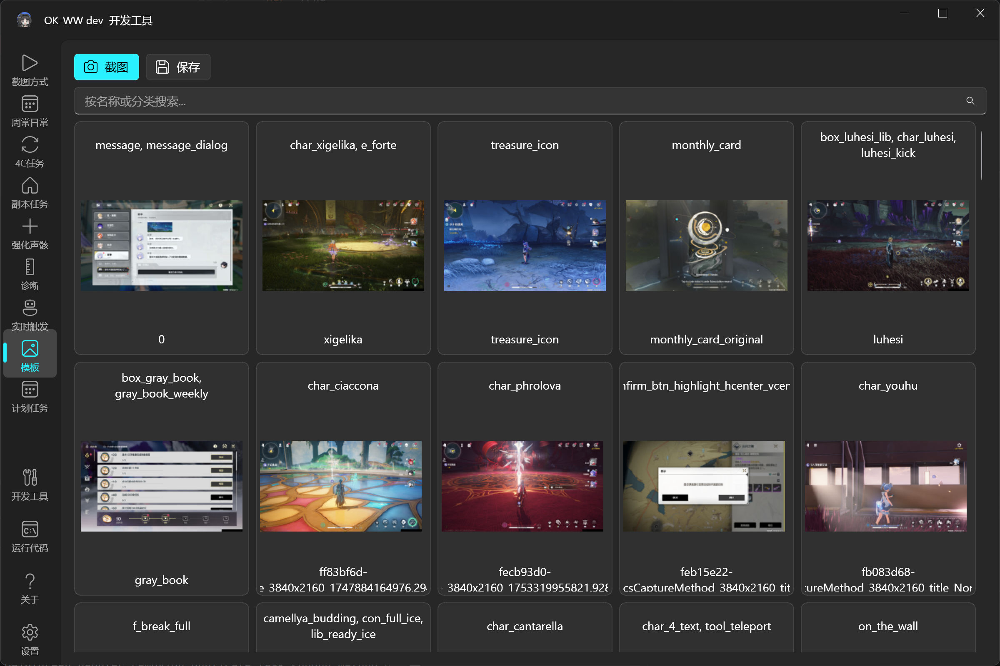
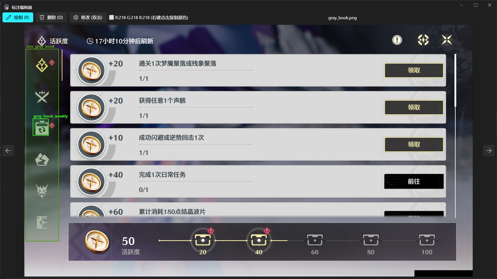

## ok-py

English | [中文](README.md)

ok-py is a Python automation project template built on [ok-script](https://github.com/ok-oldking/ok-script). It includes a runnable GUI app, task examples, configuration widget examples, OCR examples, template matching examples, tests, localization files, and packaging configuration.

This repository is not a finished automation tool for a specific game. It is a starter project and feature demo for building your own ok-script application.

### Demo

**API list and script recording**



**Capture and interaction methods**



**Annotation management and template matching**




## What Is Included

- A runnable ok-script GUI application entry point.
- `MyOneTimeTask`, a sample task that demonstrates common task APIs and config widgets.
- Config widget examples: drop-down, boolean, integer, float, string, text edit, list, multi-selection, file selector, folder selector, global config, and button groups.
- OCR, relative-region OCR, and template matching examples.
- A `ConfigOption` global configuration example.
- `TaskTestCase` automated test examples.
- i18n `.po` files and compiled `.mo` files.
- `pyappify.yml` and GitHub Actions packaging/release configuration.

## Quick Start

Python 3.12 is recommended. On Windows, automation projects often need the terminal, PyCharm, or VS Code to run as administrator.

```bash
pip install -r requirements.txt --upgrade
python main_debug.py
```

Run normal mode:

```bash
python main.py
```

Run tests:

```bash
python -m unittest tests.TestMain
```

## Project Layout

```text
src/tasks              Sample task classes
src/config.py          ok-script app configuration
src/ui                 Custom UI tab example
tests                  Automated tests
assets                 Template matching assets and COCO annotations
docs/images            Demo images used by the README
i18n                   Localization files
icons                  App icons
main.py                Normal entry point
main_debug.py          Debug entry point
pyappify.yml           Packaging configuration
deploy.txt             File list synced to the update repository during release
.github/workflows      Build and release workflows
```

## Developing Tasks

The main sample task is in `src/tasks/MyOneTimeTask.py`. Start there to:

- Add default task settings in `default_config`.
- Choose config widget types in `config_type`.
- Write automation logic in `run()`.
- Use `self.ocr()` for text recognition.
- Use `self.find_one()` or `self.find_feature()` for template matching.
- Use `self.info_set()` to show task state in the UI.
- Use `self.log_info(..., notify=True)` to send notifications.

With custom tasks enabled, you can also create and edit task scripts from the GUI.

## Packaging And Release

The repository includes GitHub Actions workflows. Pushing a matching tag triggers the build:

```text
v*.*.*
```

The build uses `pyappify.yml` to package the app and `deploy.txt` to decide which files are synced to the update repository.

## ok-script Documentation

- [Intro to game automation](https://github.com/ok-oldking/ok-script/blob/master/docs/intro_to_automation/README.md)
- [Quick start](https://github.com/ok-oldking/ok-script/blob/master/docs/quick_start/README.md)
- [After quick start](https://github.com/ok-oldking/ok-script/blob/master/docs/after_quick_start/README.md)
- [API docs](https://github.com/ok-oldking/ok-script/blob/master/docs/api_doc/README.md)

## Community

- QQ user group: `1097603920`
- QQ developer group: `938132715`
- Discord: https://discord.gg/vVyCatEBgA

## Credits

- [ok-script](https://github.com/ok-oldking/ok-script)
- [OnnxOCR](https://github.com/ok-oldking/OnnxOCR)
- [PyQt-Fluent-Widgets](https://github.com/zhiyiYo/PyQt-Fluent-Widgets)
